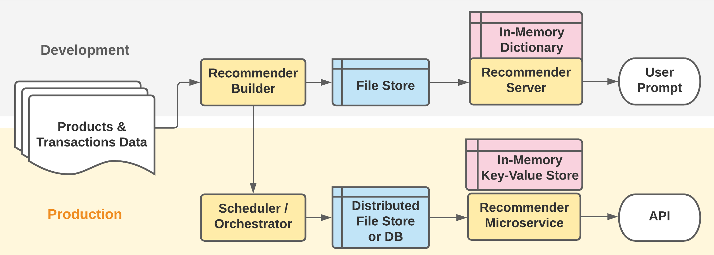

# Retail Baseline Recommendation Model

## Overview

The task’s goal is to generate a baseline model for product recommendations based solely on historical item co-purchases. Unlike Apriori and other association algorithms, this baseline model does not factor in variables like support, confidence and lift, but is a good starting point. This model can then be used to serve recommendations on a product detail page.

## Development Approach
As most of the model building steps are highly parallelizable, the Dask library is used to coordinate parallel tasks and facilitate execution on both a local and distributed cloud cluster. Using Dask should allow the model to 
scale for larger datasets via cluster scaling without needing to employ other analytics solutions such as Spark.

- `RecommenderBuilder` computes recommendation results and persists them to a file store. 
- `RecommenderServer` then read the results into memory for fast retrieval upon request.



## Source Data Files

Data files (i.e. products.txt, transactions.txt) should be stored in 'data' folder for correct execution. Samples files are provided.

- products.txt - tab separated list (product ID, category code, product name)
- transactions.txt - json list of customer transactions

## Model Building

Steps for generating co-purchase-based recommendations:
1. Read source "product" and "transaction" files into Dask data structures.
2. Generate co-purchase pairs for all items within a transaction.
3. Flatten co-purchase pairs into a single data structure (including both variants of a pairing: A,B and B,A).
4. Compute frequency for each pair, then grouping by product A, limit to top 5 pairings with highest co-purchase frequencies.
5. Merge with "product" data structure to retrieve product name details for top-pairing products.
6. Persist resulting recommendations to file store.

## Model Serving (Development)

Steps for serving recommendations for specified product IDs:
1. Read recommendations from file store into Pandas data structure.
2. Convert results into a simulated key-value store (dictionary data structure).
3. Upon submitted product ID user prompt, return corresponding recommendations list or an empty list if not found.

## Model Deployment to Production

For improved performance, the following modifications should be made:
1. Use a workflow orchestrator such as Airflow to coordinate scheduled execution of tasks within `RecommenderBuilder`.
a. Parameterize source file locations, cluster resources, and destination file store as orchestrator variables.
2. Save recommendation results to a distributed file store or database.
3. Serve model results from a containerized recommender microservice that reads computed recommendation into an in-memory key-value store such as Redis or Memcached, allowing for quick retrieval via an API
4. Deploy and provision required cloud infrastructure using tools such as Terraform or CloudFormation. Updates via CI/CD.

## Project Usage

#### Create and enable virtual environment

```
python -m venv venv/
source venv/bin/activate
```

#### Install required dependencies

```
pip install -r requirements.txt
```

## Usage

Within virtual environment

#### Serve recommender model results

```
python recommender.py
```

#### Build model results prior to serving

```
python recommender.py build
```

## Folder Structure

- data: raw source files
- docs: summary write-up
- output: processed output files
- recommender: source files for recommendation model building and serving
- submission: source file used for test submission
